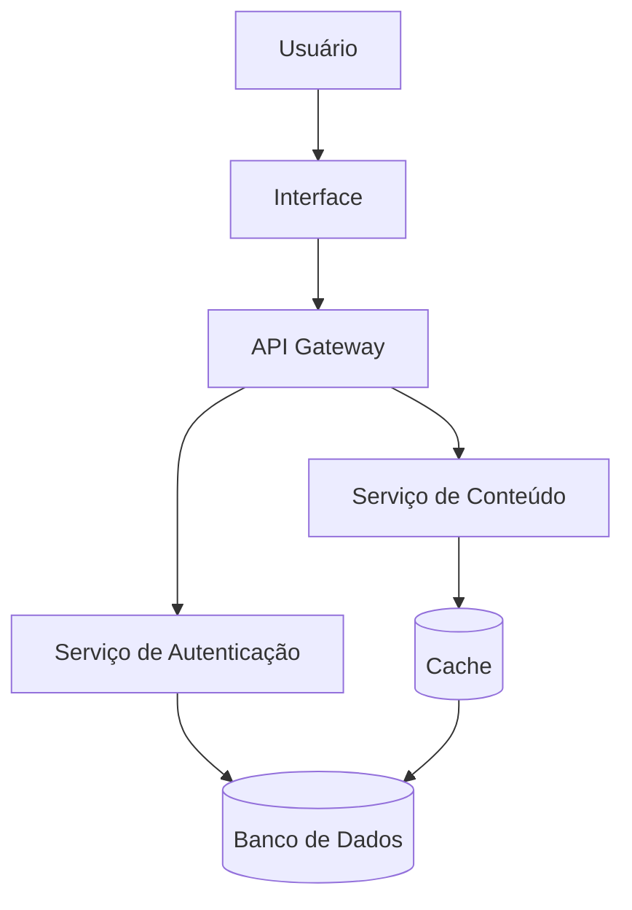
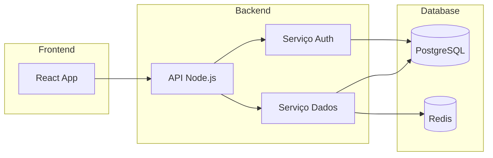
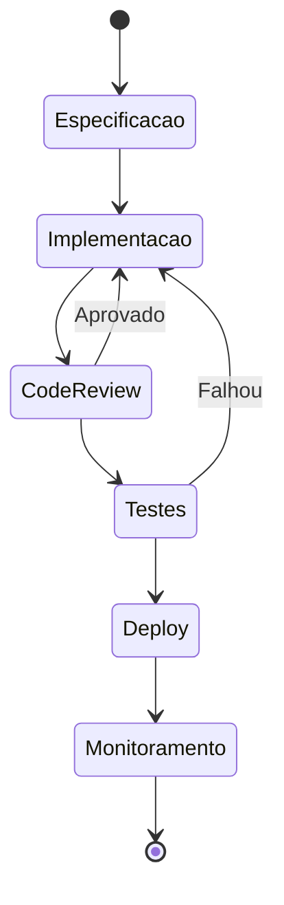
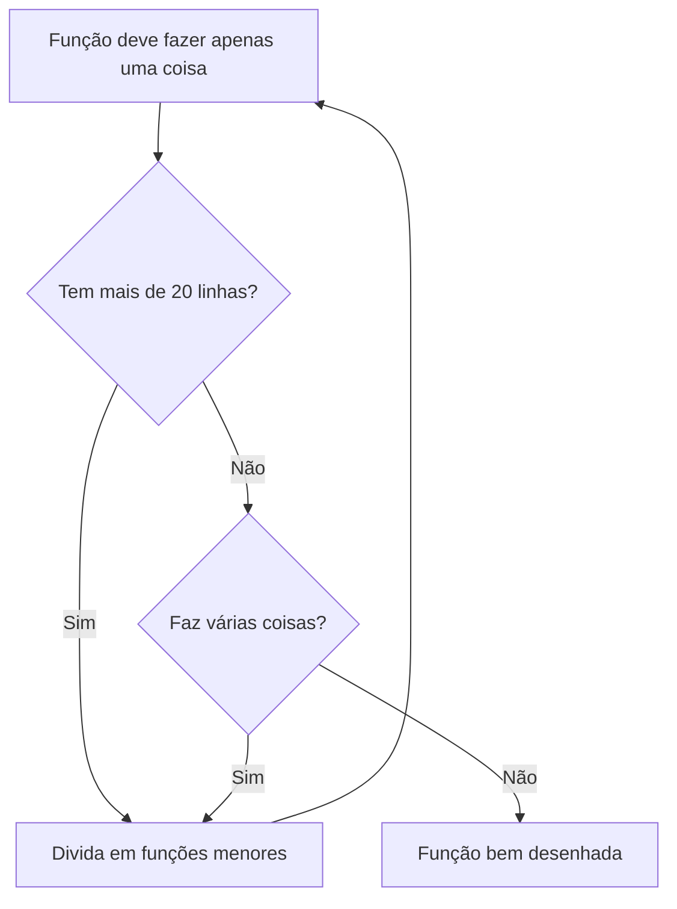

# Como Desenvolver Software de Qualidade

Um guia prático sobre as práticas essenciais para criar código limpo, manutenível e robusto.

---

## Introdução

Desenvolver software de qualidade não é apenas sobre escrever código que funciona. É sobre criar soluções que possam ser compreendidas, mantidas e evoluídas por outros desenvolvedores — incluindo você mesmo no futuro.

> "O código que você escreve hoje será mantido por alguém no futuro. Na maioria das vezes, esse alguém será você."

---

## Os Pilares da Qualidade de Software

### 1. Legibilidade

O código deve ser escrito para humanos, não para máquinas. Um código legível reduz a carga cognitiva e permite que novos membros da equipe entendam o sistema rapidamente.

```typescript
// ❌ Difícil de entender
const d = (a, b) => a.map((x, i) => ({ ...x, ...b[i] }));

// ✅ Legível e descritivo
const mergeUsersWithAddresses = (
  users: User[],
  addresses: Address[]
): MergedUser[] => {
  return users.map((user, index) => ({
    ...user,
    ...addresses[index],
  }));
};
```

### 2. Testabilidade

Código testável é código bem desenhado. Quando você consegue escrever testes facilmente, geralmente significa que suas funções têm responsabilidades claras e baixo acoplamento.

---

## Arquitetura de Sistemas

### Fluxo de Dados



### Diagrama de Componentes



---

## Fluxo de Trabalho

### Desenvolvimento Iterativo



---

## Boas Práticas de Código

### Nomenclatura

| Contexto | ❌ Evitar | ✅ Recomendado |
|----------|-----------|----------------|
| Variável | `d`, `tmp`, `x` | `userName`, `totalCount` |
| Função | `process()`, `handle()` | `fetchUserData()`, `validateEmail()` |
| Classe | `Manager`, `Handler` | `UserRepository`, `PaymentProcessor` |
| Constante | `MAX`, `LIMIT` | `MAX_RETRY_ATTEMPTS`, `DEFAULT_TIMEOUT_MS` |

### Estrutura de Funções



---

## Monitoramento e Observabilidade

### Tríade de Observabilidade

A observabilidade de um sistema é composta por três pilares fundamentais que devem trabalhar juntos para proporcionar visibilidade completa do comportamento da aplicação.

**1. Logs**
Registro cronológico de eventos que aconteceram no sistema. Capturam o que aconteceu, quando aconteceu e em qual contexto.

**2. Métricas**
Valores numéricos que representam o estado do sistema em um momento específico. Úteis para identificar tendências e anomalias.

**3. Traces**
Rastreamento de uma requisição através de todos os serviços. Permite entender a jornada completa de uma operação.

---

## Conclusão

Lembre-se: código bom é código que você consegue explicar para um colega às 3 da manhã quando o sistema está fora do ar. Escreva para o futuro, porque o futuro é você mesmo.

> "Sempre escreva código como se a próxima pessoa a mantê-lo fosse um psicopata violent que sabe onde você mora."

---

*Este documento faz parte do guia de boas práticas da equipe.*